# chapter5-learning_CSRNet

What **CSRNet** is doing: counting the number of people in the picture

------

I encountered some problems when building the environment according to the author's github(https://github.com/leeyeehoo/CSRNet-pytorch). I debugged it and Baidu took a long time to solve it. The purpose of writing this chapter is to help everyone learn better and take less detours.

In this article I will lead everyone to debug the code and visualize it.

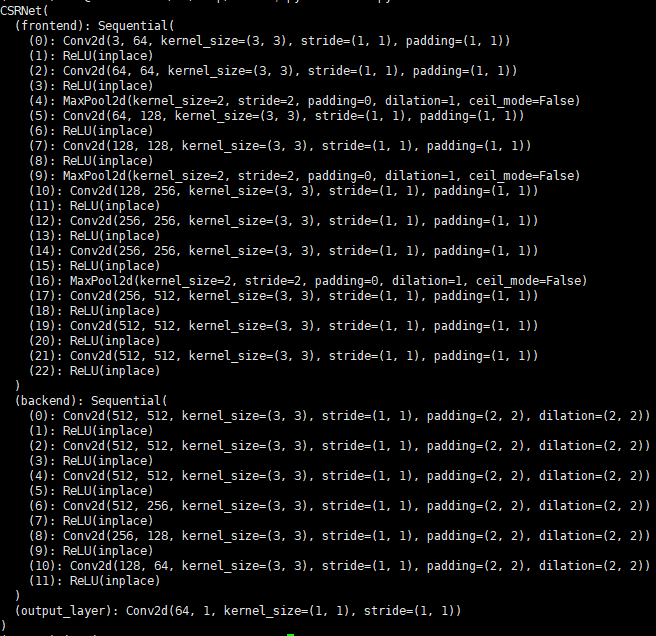

------

## step1. install

For the specific installation process, you can refer to the author's github. Here I simply show the command line of my operation.

```
conda create -n CSRNet python=3.6
source activate CSRNet
unzip CSRNet-pytorch-master.zip
pip install -i https://pypi.tuna.tsinghua.edu.cn/simple torch torchvision
pip install decorator cloudpickle>=0.2.1 dask[array]>=1.0.0 matplotlib>=2.0.0 networkx>=1.8 scipy>=0.17.0 bleach python-dateutil>=2.1 decorator
unzip ShanghaiTech_Crowd_Counting_Dataset.zip
jupyter nbconvert --to script make_dataset.ipynb  #Convert .ipynb file to .py file
```

## step2.  make_dataset.py

I just run the command to convert the **make_dataset.ipynb** file to a **make_dataset.py** file.Now you need to modify the contents of the **make_dataset.py** file.

Find the location where **root** is, add **def main()** in the above line

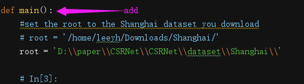

Add these two lines at the end of the **make_dataset.py**, adjust the format of the code

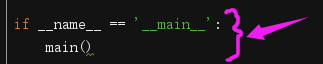

There is an error in the author's source code, you need to change the code

Replace **pts = np.array(zip(np.nonzero(gt)[1], np.nonzero(gt)[0]))** with **pts = np.array(list(zip(np.nonzero(gt)[1], np.nonzero(gt)[0])))** 

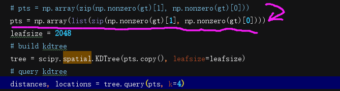

Then run the **make_dataset.py** file

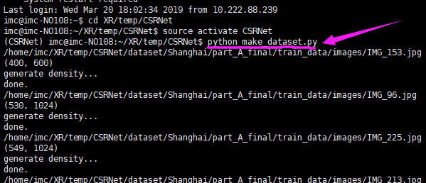

------

**The above is just a general summary, then we will run and visualize the line-by-line code.**

I will use this image as an example.

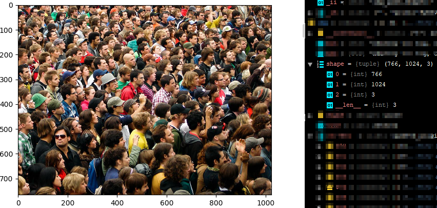

```
# coding: utf-8
import h5py
import scipy.io as io
import PIL.Image as Image
import numpy as np
import os
import glob
from matplotlib import pyplot as plt
from scipy.ndimage.filters import gaussian_filter 
import scipy
import json
from matplotlib import cm as CM
from image import *
from model import CSRNet
import torch
img_path='D:\\paper\\CSRNet\\CSRNet\\dataset\\Shanghai\\part_A_final\\train_data\\images\\IMG_21.jpg'
mat='D:\\paper\\CSRNet\\CSRNet\\dataset\\Shanghai\\part_A_final\\train_data\\ground_truth\\GT_IMG_21.mat'
mat = io.loadmat(mat)
img= plt.imread(img_path)
k = np.zeros((img.shape[0],img.shape[1]))
```

The following is the information of **k**

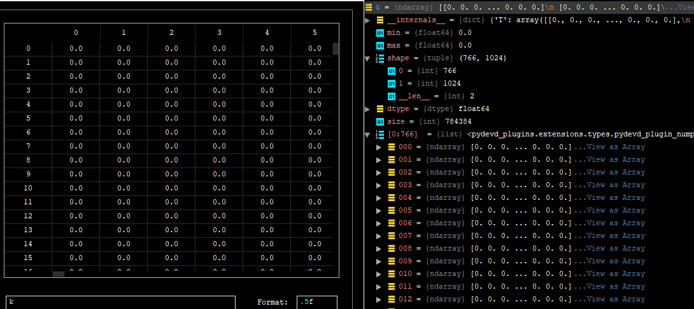

```
gt = mat["image_info"][0,0][0,0][0]
```

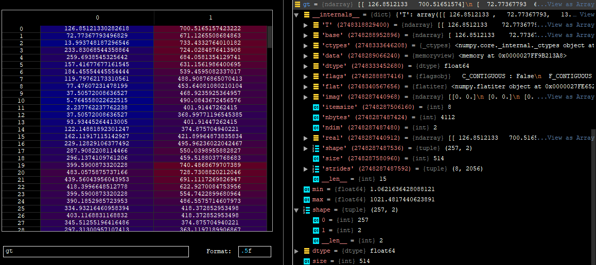

```
for i in range(0,len(gt)):
    if int(gt[i][1]) 1:
        sigma = (distances[i][1]+distances[i][2]+distances[i][3])*0.1
    else:
        sigma = np.average(np.array(gt.shape))/2./2. #case: 1 point
    density += scipy.ndimage.filters.gaussian_filter(pt2d, sigma, mode='constant')
print('done.')
```

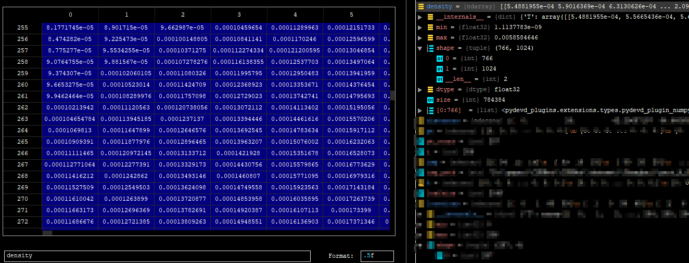

```
k = density
with h5py.File(img_path.replace('.jpg','.h5').replace('images','ground_truth'), 'w') as hf:
        hf['density'] = k
```

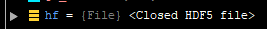

So far, we have generated true values for the image.  At this point I will sort the above code as follows

```
# coding: utf-8
import h5py
import scipy.io as io
import PIL.Image as Image
import numpy as np
import os
import glob
from matplotlib import pyplot as plt
from scipy.ndimage.filters import gaussian_filter 
import scipy
import json
from matplotlib import cm as CM
from image import *
from model import CSRNet
import torch
def gaussian_filter_density(gt):
    print(gt.shape)
    density = np.zeros(gt.shape, dtype=np.float32)
    gt_count = np.count_nonzero(gt)
    if gt_count == 0:
        return density

    # pts = np.array(zip(np.nonzero(gt)[1], np.nonzero(gt)[0]))
    pts = np.array(list(zip(np.nonzero(gt)[1], np.nonzero(gt)[0])))
    leafsize = 2048
    # build kdtree
    tree = scipy.spatial.KDTree(pts.copy(), leafsize=leafsize)
    # query kdtree
    distances, locations = tree.query(pts, k=4)

    print('generate density...')
    for i, pt in enumerate(pts):
        pt2d = np.zeros(gt.shape, dtype=np.float32)
        pt2d[pt[1],pt[0]] = 1.
        if gt_count > 1:
            sigma = (distances[i][1]+distances[i][2]+distances[i][3])*0.1
        else:
            sigma = np.average(np.array(gt.shape))/2./2. #case: 1 point
        density += scipy.ndimage.filters.gaussian_filter(pt2d, sigma, mode='constant')
    print('done.')
    return density
img_path='D:\\paper\\CSRNet\\CSRNet\\dataset\\Shanghai\\part_A_final\\train_data\\images\\IMG_21.jpg'
mat='D:\\paper\\CSRNet\\CSRNet\\dataset\\Shanghai\\part_A_final\\train_data\\ground_truth\\GT_IMG_21.mat'
img_paths = []
img_paths.append(img_path)
    for img_path in img_paths:
        print(img_path)
        mat = io.loadmat(mat)
        img= plt.imread(img_path)        
        k = np.zeros((img.shape[0],img.shape[1]))
        gt = mat["image_info"][0,0][0,0][0]
        for i in range(0,len(gt)):
            if int(gt[i][1])<img.shape[0] and int(gt[i][0])<img.shape[1]:
                k[int(gt[i][1]),int(gt[i][0])]=1
        k = gaussian_filter_density(k)        
        with h5py.File(img_path.replace('.jpg','.h5').replace('images','ground_truth'), 'w') as hf:
                hf['density'] = k
```

------

And....then, let's plot the true values of the image:

```
gt_file = h5py.File(img_paths[0].replace('.jpg','.h5').replace('images','ground_truth'),'r')
```


```
groundtruth = np.asarray(gt_file['density'])
```

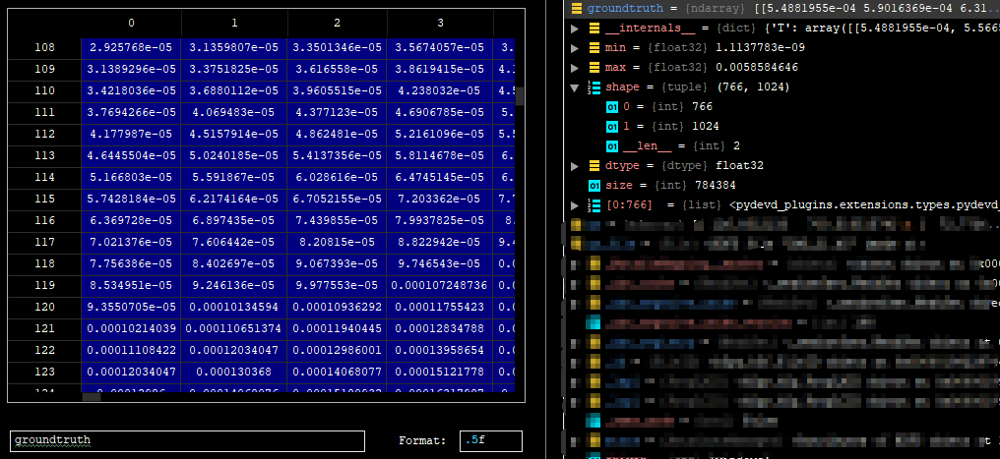

plot the true values of the image

```
plt.imshow(groundtruth,cmap=CM.jet)
```

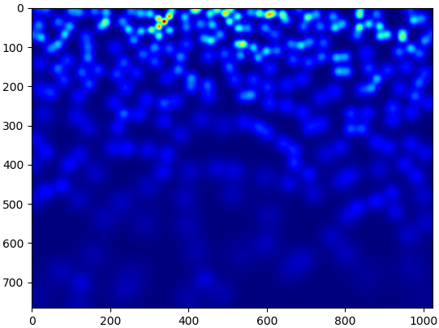

Calculate how many people are in this picture

```
np.sum(groundtruth)
```

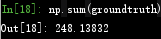

------

**Based on the same operation above, I generated true values for all images in the dataset. The following operations are performed on the gpu server.**

That is, run the command line **python make_dataset.py** on the server to get the true value of all the pictures.

## step3.  Training

**Note**: if you use the python3.x

```
1. In model.py, change the xrange in line 18 to range
2. In model.py, change line 19 to: list(self.frontend.state_dict().items())[i][1].data[:] = list(mod.state_dict().items())[i][1].data[:]
3. In image.py, change line 40 to: target = cv2.resize(target,(target.shape[1]//8,target.shape[0]//8),interpolation = cv2.INTER_CUBIC)*64
```

- In  part_A_train.json:change the path of images
- In  part_A_val.json: change the path of images

run 

```
python train.py part_A_train.json part_A_val.json 0 0
```


## step4. Testing

These are our test images. number：182

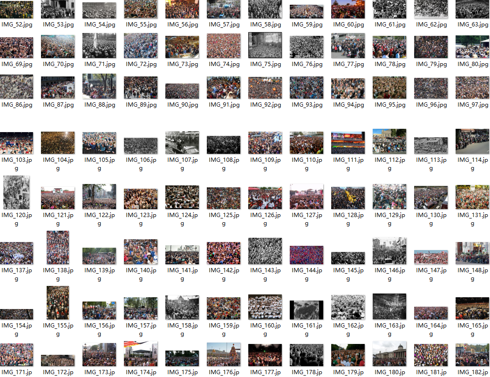

```
jupyter nbconvert --to script val.ipynb
```

Finally, the performance of this model on invisible data is tested. We will use the val.py file to verify the results. Remember to change the path to pre-train weights and images.

```
python val.py
```

The average absolute error value that can be obtained by running this val.py file code

total ：182

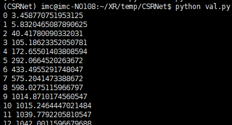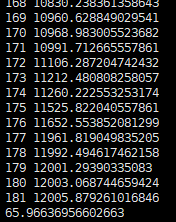

The average absolute error value obtained is 65.96636956602663, which is very good.

------

Now let's examine the predicted values on a single image:

run

```
python test_single-image.py
```

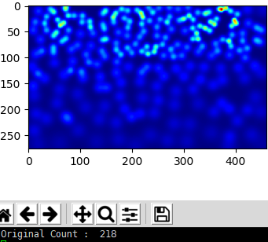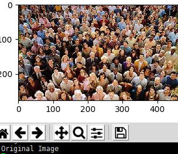

another one

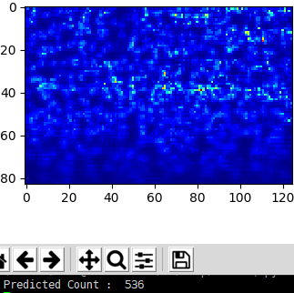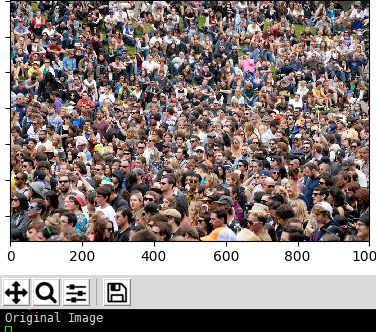

The effect is not too good，maybe the model is not trained enough，i guess。

------

## Reading paper   https://arxiv.org/pdf/1802.10062.pdf

先说数据集用的ShanghaiTech dataset，根据.jpg和.mat处理之后生成train_den文件夹下.csv文件和图片一一对应


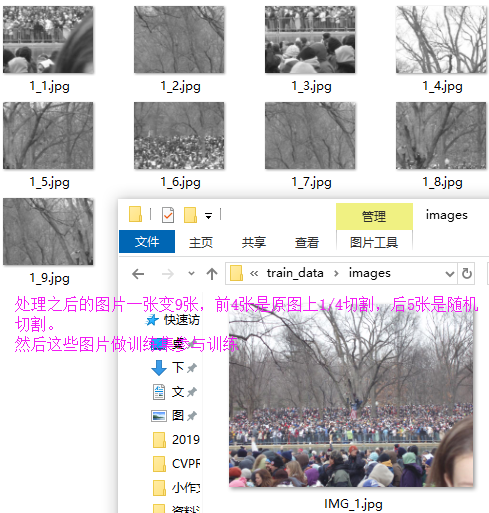

数据集扩充处理再补充一下：使用的是高斯模糊作用于图像中的每个人的头部。所有图像都被裁剪成9块，每块的大小是图像原始大小的1/4。

----------------------------------------

空洞卷积也有的博客翻译成膨胀卷积、扩张卷积啥的，anyway，使用扩张卷积是在不增加参数的情况下扩大内核。因此，如果扩张率为1就是中间的图在整个图像上进行卷积。将膨胀率增加到2最右边图它可以替代pooling层


接下来再说它的数学公式上怎么计算的，

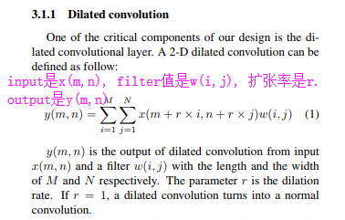

由上公式得到这个([k + (k-1)*(r-1)] * [k + (k-1)*(r-1)])


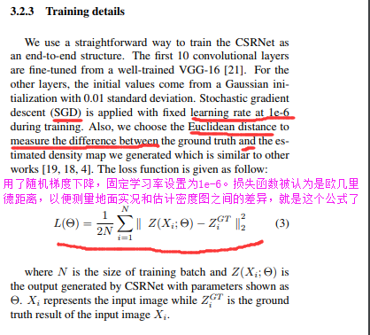

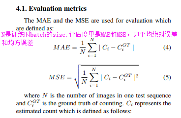

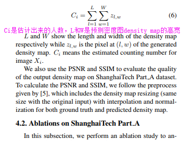

这个过程是：首先预测出给定图像的密度图。如果没有人，像素值pixel value设为0。如果该像素对应于人，则将分配某个预定义值。所以图像中的人数就是总共有的像素值total pixel values 